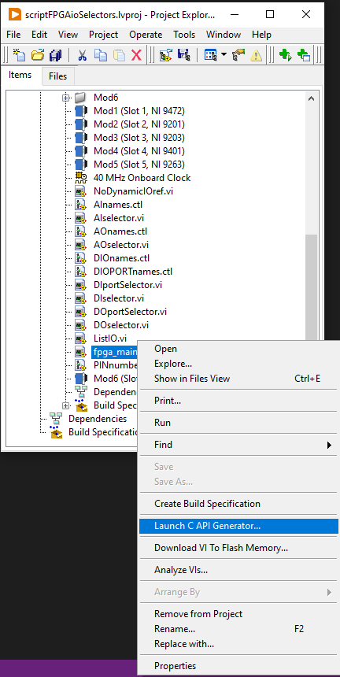
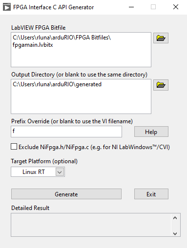

# Do not edit these files; they are automatically generated by LabVIEW.

These files need to be generated by running the LabVIEW C API generator
- Right-click the fpga_main.vi on the project and Launch the C API generator

- Make sure that the generated bitfile is inside arduRIO/FPGABitfiles without spaces
- Set the Prefix Override to f and the target Platform to Linux RT
